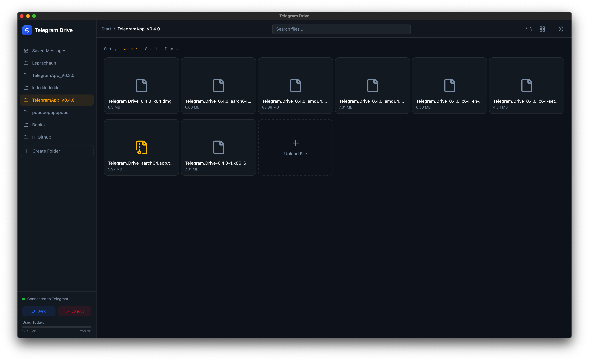
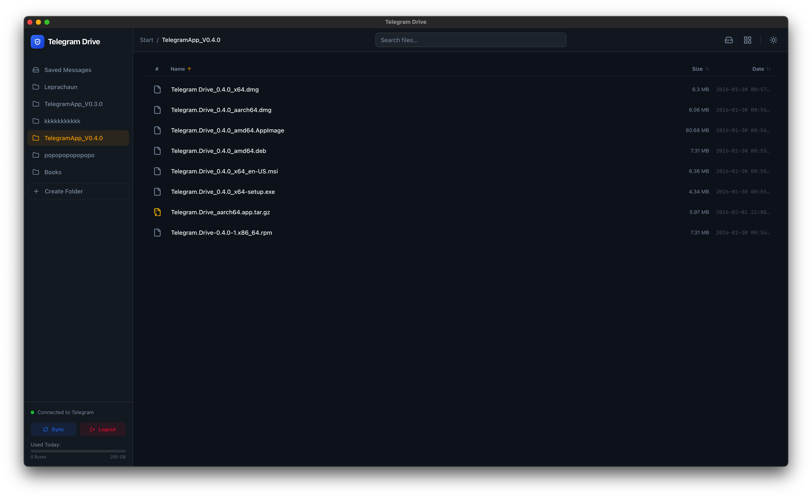

# TgGuild

<div align="center">
  
  <br />
  

### A cross-platform desktop workspace powered by Telegram for secure file storage and team collaboration.
</div>

---

TgGuild is an open-source desktop application built with **Tauri**, **Rust**, and **React**. It uses Telegram as the foundation for cloud file storage and team collaboration, providing a familiar workspace experience without requiring additional servers or databases.

> [!NOTE]
> TgGuild is based on the open-source **Telegram-Drive** project by **caamer20**. It extends the original project with team collaboration features, media streaming, an improved file management experience, and various usability enhancements while continuing to leverage Telegram as the underlying platform.

---

## Highlights

- Telegram-powered cloud file storage
- Team collaboration through Telegram groups
- Built-in media streaming and PDF viewer
- QR code and two-factor authentication support
- Native cross-platform desktop application built with Tauri

---

## Features

### File Management

- Upload and download files with real-time progress tracking.
- Create, rename, move, and delete folders.
- Organize files through a familiar drive-style interface.
- Drag files between folders within the application.
- Search files across your workspace.
- Share and forward files to chats and teams.

### Team Collaboration

- Create and manage teams backed by Telegram groups.
- Real-time messaging.
- Message reactions and replies.
- Pinned and starred messages.
- Typing indicators and online presence.
- Voice messages with inline playback.
- Forward messages across chats.

### Media and Preview

- Inline audio and video playback.
- Built-in PDF viewer.
- Image previews with thumbnail grids.
- Lazy loading for improved performance.

### Authentication

- Phone number authentication.
- Two-factor authentication (2FA).
- QR code login using the Telegram mobile application.

### Productivity

- Keyboard shortcuts for common actions.
- Automatic application updates.
- Dark and light themes.
- Workspace visibility controls.
- Optional Google Meet link generation for team collaboration.

---

## Screenshots

| Dashboard | File Preview |
|-----------|--------------|
|  |  |

| Grid View | Authentication |
|-----------|----------------|
|  |  |

| Audio Playback | Video Playback |
|----------------|----------------|
|  |  |

| Auth Code Screen | Upload Example |
|------------------|----------------|
|  |  |

| Folder Creation | Folder List View |
|-----------------|------------------|
|  |  |

---

## Tech Stack

### Frontend

- React 19
- TypeScript
- Tailwind CSS v4
- Framer Motion
- TanStack Query
- TanStack Virtual
- PDF.js
- Lucide React

### Backend

- Rust
- Tauri v2
- Grammers (Telegram MTProto Client)
- Actix Web
- Tokio

### Build and Tooling

- Vite
- Cargo
- GitHub Actions

---

## Architecture

```text
                 React Frontend
                        |
                        v
                   Tauri IPC
                        |
                        v
                  Rust Backend
                 /              \
Telegram MTProto API     Local Media Streaming
```

TgGuild combines a React frontend with a Rust backend through Tauri IPC. Telegram provides the underlying cloud infrastructure for file storage and team collaboration, while a lightweight local media service enables smooth streaming and preview of supported files.

---

## Getting Started

### Prerequisites

- Node.js v18 or later
- Rust (latest stable)
- Telegram API credentials (`api_id` and `api_hash`)
- Platform-specific build tools

#### Windows

Visual Studio Build Tools with the **Desktop development with C++** workload.

#### macOS

Xcode Command Line Tools.

#### Linux

- `libwebkit2gtk-4.1-dev`
- `build-essential`

---

### Installation

```bash
git clone https://github.com/astralink-hkrm/TgGuild.git
cd TgGuild/app
npm install
```

Generate application icons:

```bash
npm run tauri icon ../Public/logo.png
```

Run in development mode:

```bash
npm run tauri dev
```

Build the production application:

```bash
npm run tauri build
```

---

## Usage

### Authentication

Sign in using your phone number or scan a QR code from the Telegram mobile app. If two-factor authentication (2FA) is enabled on your Telegram account, you will be prompted to enter your password before accessing the application.

### File Management

Navigate your personal drive or team workspaces from the sidebar. Upload files, create folders, organize your content, and use familiar actions such as rename, move, delete, and share to manage your workspace efficiently.

### Teams

Create teams backed by Telegram groups, invite members using shareable links, exchange messages, collaborate on shared files, and generate optional Google Meet links directly from team conversations.

### Media

Open images, videos, audio files, and PDFs directly inside the application. Built-in media playback and document preview provide a seamless viewing experience without leaving TgGuild.

---

## Security

- Telegram API credentials and session data are stored locally on your device and are never sent to third-party servers.
- Media streaming runs through a locally authenticated service to provide secure playback within the application.
- Content Security Policy (CSP) restricts unauthorized network access and helps protect the application from unwanted external resources.
- Filesystem access is limited to the directories required by the application for secure storage and temporary files.
- Automatic updates are cryptographically verified before installation to ensure update authenticity and integrity.

---

## Roadmap

- Cross-platform CI builds for Linux and macOS
- Folder-level sharing between users
- Native OS drag-and-drop for file uploads
- Advanced file search with filters
- System tray support and background notifications
- Expanded collaboration and workspace features

---

## Contributing

Contributions are welcome!

Before submitting a pull request:

1. Install the required prerequisites (Node.js, Rust, and platform-specific build tools).
2. Clone the repository and install project dependencies.
3. Start the development environment using:

   ```bash
   npm run tauri dev
   ```

4. Follow the existing project structure and coding conventions.
5. TypeScript code should follow the project's strict type checking, and Rust code should pass `cargo clippy` without warnings whenever possible.
6. For significant changes or new features, please open an issue first to discuss the proposed approach.

---

## License

This project is licensed under the MIT License.

---

## Disclaimer

This application is **not affiliated with Telegram FZ-LLC**. Please use it responsibly and in accordance with Telegram's Terms of Service.

---

## Acknowledgements

TgGuild is based on the open-source **Telegram-Drive** project created by **caamer20**.

We sincerely appreciate the original project and its contributions to the open-source community. If you find TgGuild useful, please consider supporting the original developer.

<div align="center">
  <a href="https://www.paypal.me/Caamer20">
    
  </a>
</div>
